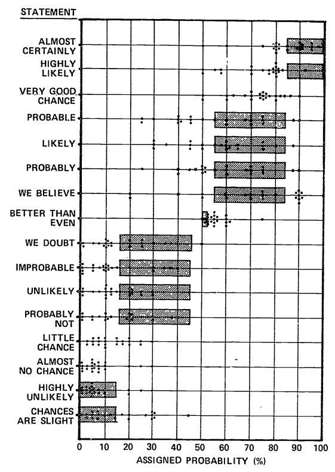
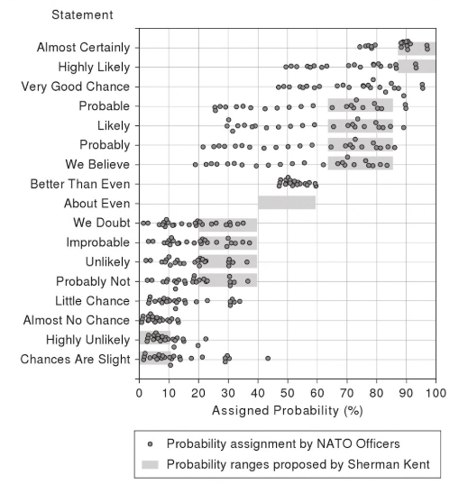
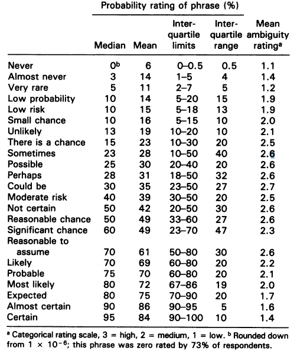
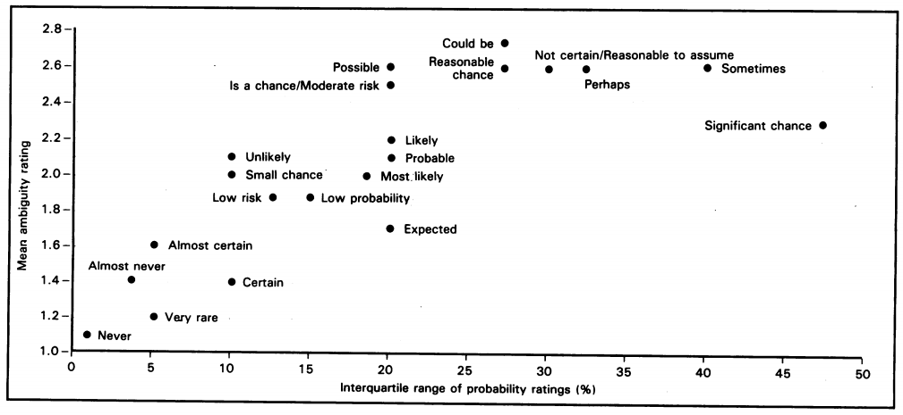

<h1>Perception of Probability Words</h1>

<h2>Overview</h2>

  It is common for you to find articles everywhere that use probabilistic words to describe events.  Just a few examples I found in a quick internet search:
  <blockquote>
    "'<b>Highly unlikely</b>' State of the Union will happen amid shutdown"
    &ndash;
    <a href="https://thehill.com/homenews/house/426591-top-dem-highly-unlikely-state-of-the-union-will-happen-amid-shutdown" target="_blank">The Hill</a>
     
    "Tiger Woods makes Masters 15th and <b>most improbable</b> major"
    &ndash;
    <a href="https://www.foxbusiness.com/features/tiger-woods-wins-masters-to-end-11-year-major-drought" target="_blank">Fox Business</a>
     
    "Trump predicts <b>'very good chance'</b> of China trade deal"
    &ndash;
    <a href="https://www.cnn.com/2019/02/22/politics/trump-china-trade-talks/index.html" target="_blank">CNN</a>
  </blockquote>

  A study in the 1960s explored the perception of probabilistic words like these among NATO officers.  Curious on
  how this differs today, I asked <b>my connections on social media</b> to take a survey of their perception of the same
  probabilistic words studied by the NATO.  Among the <b>123 people who responded</b>, a simple visualization to show their perception.

  <b>Interact</b>: Tap/hover over any circle to view a single person's response to every phrase.

<h2>Perceptions</h2>

  In general, the perceptions that we hold of probabilistic words has changed very little since the studies in the 1950s.
  The first trend that is very clear when viewing individual responses in aggregate is that nearly everyone tends to choose probabilities that end
  in a 0 or a 5, like 20% or 85%.   Among all 2,091 responses, 1,795 (85.8%) of the responses end in a 0 or 5 &mdash;
  <i>we could say there is a <b>very good chance</b> your response will end in a 0 or 5</i>.

  A second clear trend is some probabilistic words have a narrower range of perception than other words.  The box plot
  visualization shows a shaded box that includes the range of responses that encompass the middle-50% of responses.
  This middle 50% is known as the Interquartile Range or IQR.  For example:

<ul>
  <li>
    The IQR of <b>about even</b> is 0% (the box is a single line) &mdash; the middle 50% of all respondents
    perceive <b>about even</b> to be 50%.
  </li>
  <li>
    The IQR of <b>we believe</b> is among the largest (the box covers 20%) &mdash;
    the middle 50% of all respondents perceive <b>we believe</b> to be between 65% - 85%.
  </li>
</ul>

  The following table ranks every word by the width of the IQR:

<table class="table table-sm table-responsive waf-table-data">
  <thead>
    <tr><th>Probability Word</th><th>IQR 
Middle 50%
</th></tr>
  </thead>
  <tbody>
    <tr><td>About Even</td><td>0.0% 
50.0% - 50.0%
</td></tr>
    <tr><td>Almost No Chance</td><td>4.0% 
1.0% - 5.0%
</td></tr>
    <tr><td>Better than Even</td><td>5.0% 
55.0% - 60.0%
</td></tr>
    <tr><td>Highly Unlikely</td><td>5.0% 
5.0% - 10.0%
</td></tr>
    <tr><td>Almost Certain</td><td>8.0% 
90.0% - 98.0%
</td></tr>
    <tr><td>Likely</td><td>10.0% 
65.0% - 75.0%
</td></tr>
    <tr><td>Chances are Slight</td><td>10.0% 
10.0% - 20.0%
</td></tr>
    <tr><td>Little Chance</td><td>10.0% 
5.0% - 15.0%
</td></tr>
    <tr><td>Highly Likely</td><td>15.0% 
80.0% - 95.0%
</td></tr>
    <tr><td>Probable</td><td>15.0% 
60.0% - 75.0%
</td></tr>
    <tr><td>Very Good Chance</td><td>15.0% 
75.0% - 90.0%
</td></tr>
    <tr><td>Probably Not</td><td>15.0% 
15.0% - 30.0%
</td></tr>
    <tr><td>Probably</td><td>15.0% 
60.0% - 75.0%
</td></tr>
    <tr><td>Improbable</td><td>17.5% 
5.0% - 22.5%
</td></tr>
    <tr><td>We Believe</td><td>20.0% 
65.0% - 85.0%
</td></tr>
    <tr><td>We Doubt</td><td>20.0% 
10.0% - 30.0%
</td></tr>
    <tr><td>Unlikely</td><td>20.0% 
10.0% - 30.0%
</td></tr>
  </tbody>
</table>

<h2>Background</h2>

  The first widely published work to begin to analyze the perception of probabilistic words was written by Sherman Kent
  while he was working for the CIA.  Originally a classified work,
  <a href="https://www.cia.gov/library/center-for-the-study-of-intelligence/csi-publications/books-and-monographs/sherman-kent-and-the-board-of-national-estimates-collected-essays/6words.html#ft3">"Words of Estimative Probability"</a>
  was published in <i>Studies in Intelligence</i> in 1964.  In this work, Kent outlined several key terms with a probability and a range
  and proposed the scale to be used by the CIA:

<table class="table table-sm table-responsive waf-table-data mb-4">
  <thead>
    <tr>
      <th colspan="2">
        Kent's Work (1964)
        
Proposed scale for CIA officers

      </th>
      <th colspan="2">
        This Survey (2019)
        
Internet survey of primarily undergraduate students

      </th>
    </tr>
    <tr>
      <th>
        Word
        
Words with the same "linguistic expression"

      </th>
      <th>Probability
Proposed Range
</th>
      <th>Word</th>
      <th>Median 
Middle 50%
</th>
    </tr>
  </thead>
  <tbody>
    <tr>
      <td>Certain</td><td>100.0% 
100.0% - 100.0%
</td>
      <td colspan="2">&mdash;</td>
    </tr>

    <tr>
      <td rowspan="2" style="vertical-align: middle;">
        Almost Certain
        

          Virtually Certain 
          All but Certain 
          Highly Probable 
          Highly Likely 
          Odds Overwhelming
        
              
      </td><td rowspan="2" style="vertical-align: middle;">93.0% 
87.0% - 99.0%
</td>
      <td>Almost Certain</td><td>95.0% 
90.0% - 98.0%
</td>
    </tr>
    <tr> <td>Highly Likely</td><td>90.0% 
80.0% - 95.0%
</td></tr>

    <tr>
      <td rowspan="5" style="vertical-align: middle;">
        Probable
        

          Conceivable 
          Could 
          May 
          Might 
          Perhaps
        

        </td><td rowspan="5" style="vertical-align: middle;">75.0% 
63.0% - 87.0%
</td>
      <td>Very Good Chance</td><td>80.0% 
75.0% - 90.0%
</td>
    </tr>
    <tr> <td>We Believe</td><td>75.0% 
65.0% - 85.0%
</td></tr>
    <tr> <td>Probably</td><td>70.0% 
60.0% - 75.0%
</td></tr>
    <tr> <td>Probable</td><td>70.0% 
60.0% - 75.0%
</td></tr>
    <tr> <td>Likely</td><td>70.0% 
65.0% - 75.0%
</td></tr>

    <tr>
      <td rowspan="2" style="vertical-align: middle;">
        Chances About Even
        

          Chances about Even 
          Chances a Little Better than Even 
          Chances a Little Worse than Even 
          Improbable 
          Unlikely
        
              
      </td><td rowspan="2" style="vertical-align: middle;">50.0% 
40.0% - 60.0%
</td>
      <td>Better than Even</td><td>60.0% 
55.0% - 60.0%
</td>
    </tr>
    <tr> <td>About Even</td><td>50.0% 
50.0% - 50.0%
</td></tr>

    <tr>
      <td rowspan="3" style="vertical-align: middle;">
        Probably Not
        

          We Believe that Not 
          We Estimate that Not 
          We Doubt 
          Doubtful
        
          
      </td><td rowspan="3" style="vertical-align: middle;">30.0% 
20.0% - 40.0%
</td>
      <td>Probably Not</td><td>25.0% 
15.0% - 30.0%
</td>
    </tr>
    <tr> <td>We Doubt</td><td>20.0% 
10.0% - 30.0%
</td></tr>
    <tr> <td>Unlikely</td><td>20.0% 
10.0% - 30.0%
</td></tr>

    <tr>
      <td rowspan="5" style="vertical-align: middle;">
        Almost Certainly Not
        

          Virtually Impossible 
          Almost Impossible 
          Some Slight Chance 
          Highly Doubtful
        

      </td><td rowspan="5" style="vertical-align: middle;">7.0% 
2.0% - 12.0%
</td>
      <td>Little Chance</td><td>10.0% 
5.0% - 15.0%
</td>
    </tr>
    <tr> <td>Chances are Slight</td><td>10.0% 
10.0% - 20.0%
</td></tr>
    <tr> <td>Improbable</td><td>10.0% 
5.0% - 22.5%
</td></tr>
    <tr> <td>Highly Unlikely</td><td>5.0% 
5.0% - 10.0%
</td></tr>
    <tr> <td>Almost No Chance</td><td>2.0% 
1.0% - 5.0%
</td></tr>

    <tr>
      <td>Impossible</td><td>0.0% 
0.0% - 0.0%
</td>
      <td colspan="2">&mdash;</td>
    </tr>
  </tbody>
</table>

  Over a decade later, Scott Barclay et. al., working for the Advanced Research Projects Agency published a 285 page book
  entitled <a href="https://files.eric.ed.gov/fulltext/ED153329.pdf">"Handbook for Decisions Analysis"</a> for the Department of Defence.
  This work references Kent's work and a NATO study where <i>"twenty-three [NATO] officers, ranking from squadron leader to lieutenant general"</i>
  were asked about many probabilistic words.  Specifically:

<blockquote>
  Several different sentences were constructed in the following manner. "It is highly
  likely that the Soviets will invade Czechoslovakia," or "It is almost certain that the Soviets will invade Czechoslovakia,"
  or "We believe that the Soviets will invade Czechoslovakia." The basic structure of all sentences remained constant; only
  the-verbal qualifiers changed.
</blockquote>

  The results of this survey of NATO officers produced the first visualization that combined Kent's work and a human
  survey that is still widely available today.  In presentation the visualization, Barclay comments: <i>"Clearly, the readers in this
  experiment were not using the Sherman Kent scale even though they were familiar with it."</i>  Barclay's visualization
  was later recreated by others with modern typeset:

  

    
    

      Figure 3-5 in <a href="https://files.eric.ed.gov/fulltext/ED153329.pdf">"Handbook for Decisions Analysis"</a> (Barclay et. al., 1977, PDF p.79)
    

  

  

    
    

      Figure 17-1 in <a href="https://books.google.com/books?id=_X0FHYpHDzoC&pg=PA187&lpg=PA187">"Critical Thinking For Strategic Intelligence"</a> (Pherson and Pherson, 2013, PDF p.187)
    

  

  The work of assigning specific probabilities to probabilistic words has also been studied in other fields with uncertainty
  including metrology and medicine.  For example, Bernie J. O'Brien's 1989 paper
  <a href="https://pdfs.semanticscholar.org/cee4/49e65708dcba3abb42fc69ce3728642d7c1e.pdf">"Words or numbers? The evaluation of probability expressions in general practice"</a>
  surveyed <i>"communicating to patients the probability of a side-effect (headache) arising from an unspecified prescription medicine."</i>
  O'brien's worked surveyed 52 general practitioners and used
  <a href="https://en.wikipedia.org/wiki/Spearman%27s_rank_correlation_coefficient">Spearman's rank correlation coefficient</a>
  to determine a "ambiguity ranking" for each word and used a scatter plot to rank IQR range vs. ambiguity:        

  

    
    

      <b>Probability ratings of 23 phrases by 52 general practitioners</b>;
      Table 1 in <a href="https://pdfs.semanticscholar.org/cee4/49e65708dcba3abb42fc69ce3728642d7c1e.pdf">"Words or numbers? The evaluation of probability expressions in general practice"</a> (O'Brien, 1989, p.99)
    

  

  

    
    

      <b>Relationship between observed and predicted variability in meaning</b>;
      Figure 1 in <a href="https://pdfs.semanticscholar.org/cee4/49e65708dcba3abb42fc69ce3728642d7c1e.pdf">"Words or numbers? The evaluation of probability expressions in general practice"</a> (O'Brien, 1989, p.99)
    

  

  This work was popularized online in 2015 when reddit.com user <a href="https://www.reddit.com/user/zonination">/u/zonination</a>
  performed an internet survey similar to the survey done for this work.  In zonination's survey, 48 users responded and
  uploaded the data, alongside a visualization made in R, to  <a href="https://github.com/zonination/perceptions">github</a>
  and shared it on reddit.  zonination's post won the <a href="https://www.informationisbeautifulawards.com/showcase/818-perceptions-of-probability">
  2015 Kantar Information is Beautiful Award</a> and lead numerous articles across various websites and blogs:

<ul>
  <li>
    <i>"Here's how people view the difference between something being 'highly likely' and it being just 'probable'"</i>
    - <a href="https://www.businessinsider.com/quantitative-perceptions-of-probability-words-2017-5">Business Insider</a>
  </li>
  <li>
    <i>"Measuring Perceptions of Uncertainty"</i>
    - <a href="https://www.visualcapitalist.com/measuring-perceptions-of-uncertainty/">Visual Capitalist</a>
  </li>
  <li>
    <i>"Perceptions of probability"</i>
    - <a href="https://blogs.sas.com/content/iml/2017/05/03/perceptions-of-probability.html">SAS Blogs</a>
  </li>
  <li>
    ...and many others...
  </li>
</ul>

  The area of human perception of probabilistic words continues to be an area of somewhat active research, with
  peer-reviewed academic papers published as recently as last year. 

<h2>Data Set</h2>

  <b>Complete Data Set</b> (CSV): <a href="https://github.com/wadefagen/datasets/tree/master/Perception-of-Probability-Words">https://github.com/wadefagen/datasets/tree/master/Perception-of-Probability-Words</a>

<ul class="pub-list">
  <li>
    Largest known open-source survey of probabilistic words (n=123).
  </li>
  <li>
    CSV Format Details: Row 1 contains descriptive column headers; all other rows contain data.
  </li>
</ul>

<i>A previous version of this page listed an incorrect publication date for "Handbook for Decisions Analysis" and has been corrected.  Thanks to Dr. Charles Twardy for the correction.</i>

