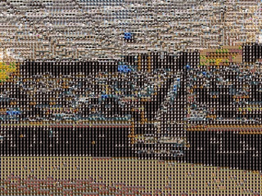

# 1989 Mosaics

One of the most important aspects of CS 340: Introduction to Computer Systems is to provide students with an experience where they are developing a small but integral part of a complex software system.  In the course, the final project is a large-scale system that uses a microservice-based design where:

1. Every student contributes multiple backend microservices to the final system, 
2. All of the microservice runs simultaneously during the deployment of the system,
3. The middleware, frontend, and other components are designed collaboratively by the class, with the ability for top students to contribute to the shared infrastructure

## The Mosaics

In Spring 2023, the names of all course assignments were Taylor Swift songs and lyrics starting with "MP0: Welcome to C, It's Been Waiting for You".  When we had a course-wide discussion on ideas, three main themes were considered for the final project:

1. a course-wide game, *this ended up being the least popular option*
2. a course-wide creative project,  *this was about half the course's favorite theme*, **OR**
3. a course-wide Taylor-inspired project  *this was also about half the course's favorite theme*

With a week of ideation, the course-wide became a mix of creativity and taylor with **1989 Mosaics -- a MapReduce-based mosaic generator** where each student developed:

- 13 microservice mosaic generators (MMGs) that each included at least 60 unique "tile images",
- a single mosaic reducer that would take two mosaics and find the best possible tile for each tile in the mosaic, and
- with the goal of creating a single mosaic reduced from over 1,989 individual mosaics!

One of the first mosaics we generated was a picture of the entire class!  The image of the entire class is the "base image" and sent to all o fthe mosaic generators:

  
 Original "Base Image"

Each of 158 students simultaneously managed 2,173 individual microservices created a mosaic.  For example, here's one student-create mosaic of the course entirely made of "tile images" that were all pictures of cats:

  
 A mosaic made entirely out of cats!

  
 An area selected to zoom in for detail.

  
 The zoomed in area of the image showing the individual tile images.

Once two mosaics are created, they can be reduced together.  The reduction finds the best possible tile image for the mosaic based off the two mosaics.  For example, the following mosaic was a reduction of one mosaic that contains 60 images of only birds and a second mosaic that contains 60 images of only flowers:

  
 A reduction of <b>two mosaics</b> (birds, flowers) into a single mosaic

  
 An area selected to zoom in for detail.

  
 The zoomed in area of the image showing the individual tile images of both flowers and birds.

Mosaics are recursively reduced, incorporated more and more mosaics -- each time improving slightly in quality:

  
 4 mosaics, 240 unique tile images

  
 8 mosaics, ~500 unique tile images

  
 16 mosaics, ~1,000 unique tile images

Mosaics are recursively reduced, incorporated more and more mosaics -- each time improving slightly in quality:

  
 48 mosaics, ~3,000 unique tile images

  
 223 mosaics, ~15,000 unique tile images

  
 683 mosaics, ~50,000 unique tile images

Finally, all the mosaics are reduced into a single mosaic:

  
 906 mosaics, ~100,000 unique tile images

  

  
 Original "Base Image" (for reference)

## Additional Base Images

Several additional mosaics were created, including one of the University of Illinois Alma Mater Status:

  
 1 mosaic

  
 2 mosaics

  
 8 mosaics

  
 16 mosaics

  
 177 mosaics

  
 1,028 mosaics

Taylor Swift's "Speak Now (Taylor's Version)" Album Cover:

  
 2 mosaic

  
 4 mosaics

  
 8 mosaics

  
 16 mosaics

  
 32 mosaics

  
 977 mosaics

## Shared Middleware 

The 1989 mosaics was created through a shared middleware, which was designed during the first two weeks of the project and the extended with advanced features.

The shared middleware was created based off of students' design submitted during the first week and then received 18 pull requests (PRs) adding additional features, fixing bugs, creating quality-of-life improvements.  The full middleware source code is available on the <a href="https://github.com/illinois/cs340-sp23-1989-shared-middleware">cs340-sp23-1989-shared-middleware repo</a> in @illinois on GitHub!

## Acknowledgements

This 1,989 mosaics was a crazy idea that could have been a complete failure, but turned into one of the largest collaborative course projects at Illinois!  It would not have been possible within:

- An amazing class of CS 340 students in Spring 2023,
- An equally amazing <a href="https://courses.grainger.illinois.edu/cs240/sp2023/syllabus/">course staff</a> who helped fix bugs in the shared infrastructure, spent hours in office hours with students debugging mosaic generators, provided encouragement to students as they were programming and debugging late into the night, and even last-minute assistance to students during the showcase itself!

Thank you! 🧡💙

