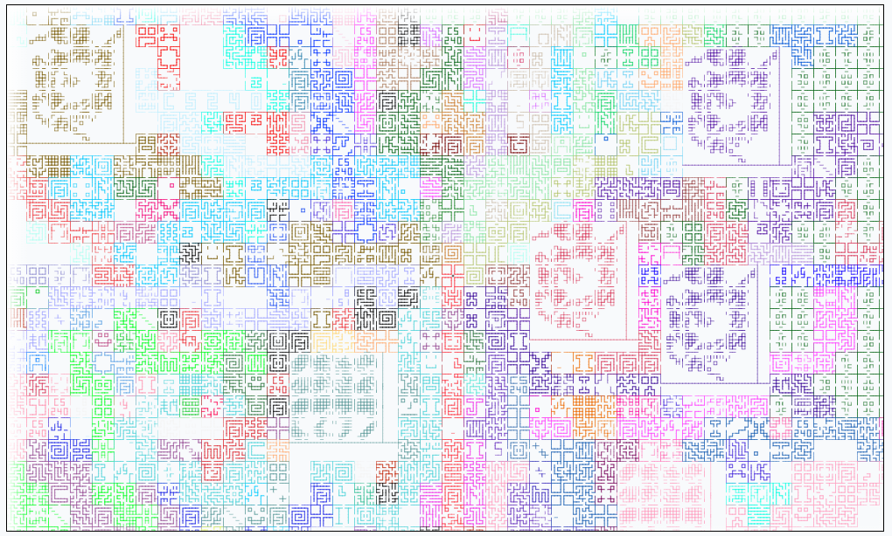
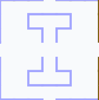
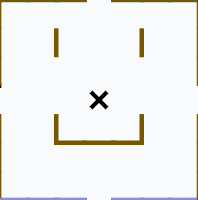

# Illinois' Infinite Maze

One design goal of CS 240/340: Introduction to Computer Systems is to provide students with an experience where they are developing a small but integral part of a complex software system.  In the course, the final project is a large-scale system that uses a microservice-based design where:

1. Every student contributes multiple backend microservices to the final system, 
2. All of the microservice runs simultaneously during the deployment of the system,
3. The middleware, frontend, and other components are designed collaboratively by the class, with the ability for top students to contribute to the shared infrastructure

## The Maze

In Spring 2022, students in CS 240 built the <b>Illinois' Infinite Maze</b>.  After four weeks of design, implementation, integration, and deployment, 91 students simultaneously managed 91 separate VMs to launch a 218 individual processes that each acted as an independent microservice that could generate a maze segment on request.  *(For example, see [@PeterYR's](https://github.com/PeterYR) maze generator microservice [source code](https://github.com/cs240-illinois/sp22_cs240_infinite-maze-shared/blob/main/maze_generators/kruskal/app.py) that generated a maze using Kruskal's Algorithm and Disjoint Sets.)*

When we met together for the final project showcase, everyone's services worked together to build one <b>GIANT</b> maze live that has now been archived in this post.  In all, this maze includes:

- A total of <b>7,150</b> maze segments generated, colored with the color of the explorer who first generated the segment,
- Generated by at least <b>86</b> simultaneous explorers that each choose their favorite color *(interestingly, this distribution followed the Pareto principle nearly perfectly, and you can see the [full distribution here](/pages/cs340/infinite-maze/final-color-count.html))*,
- Created by <b>218</b> maze generating microservices, where one microservice was randomly chosen each time a new maze segment was needed,
- Running on <b>92</b> virtual machines, 91 student-run VMs and a single VM running the middleware

At the end of the final project showcase, a <a href="mazeState.json">JSON of the entire maze</a> was saved and now <a href="maze.html?all=true">available to explored by anyone</a> (<b>or</b> explore it <a href="maze.html">without the whole maze revealed already</a>).  Here's a zoomed out view:

  <a href="maze.html?all=true">
    
    
The infinite maze, centered at (0, 0).

  </a>

## The Maze Segments

The primary software deliverable for each student was a minimum of two "maze generators" or "MGs".  Each student was given a fresh Ubuntu 18.04 VM as part of the UIUC Computer Science educational cloud.  Each student was responsible for running their MG on their VM.

The creativity of many of the maze segments is amazing:

  

    
    
A Illinois "Block-I", found at <a href="maze.html?x=-14&y=2&all=true">(-14, 2)</a>

  

  

    
    
A digital clock at 8:53pm, found at <a href="maze.html?x=87&y=150&all=true">(87, 150)</a>

  

  

    
    
A happy face, found at <a href="maze.html?x=-77&y=-7&all=true">(-77, -7)</a>

  

  

    
    
Ocean waves, found at <a href="maze.html?x=142&y=57&all=true">(142, 57)</a>

  

Additionally, students extended the maze to allow for multi-segment mazes to make artwork and other designs that exceeded the 7x7 limitation of a basic segment.  Several designs were made, including the course name in block letters:

  

    
    
A multi-segment maze piece, found at <a href="maze.html?x=196&y=73&all=true">(196, 73)</a>

  

## Shared Middleware 

The infinite maze was created through a shared middleware, which was designed during the first two weeks of the project and the extended with advanced features.

The shared middleware was created based off of students' design submitted during the first week and then received 20 pull requests (PRs) adding additional features, fixing bugs, creating quality-of-life improvements.  The full middleware source code is available on the <a href="https://github.com/cs240-illinois/sp22_cs240_infinite-maze-shared">sp22_cs240_infinite-maze-shared repo</a> in @cs240-illinois on GitHub!

## Acknowledgements

This infinite maze was a crazy idea that could have been a complete failure, but turned into one of the largest collaborative course projects at Illinois!  It would not have been possible within:

- An amazing class of CS 240 students in Spring 2022,
- An equally amazing course staff including <a href="https://courses.grainger.illinois.edu/cs240/sp2022/syllabus/">Patrick, Eunice, Bora, Jeremy, Jackson, and Kevin</a> who helped fix bugs in the shared infrastructure, spent hours in office hours with students debugging maze generators, provided encouragement to students as they were programming and debugging late into the night, and even last-minute assistance to students during the maze showcase itself!

Thank you! 🧡💙

